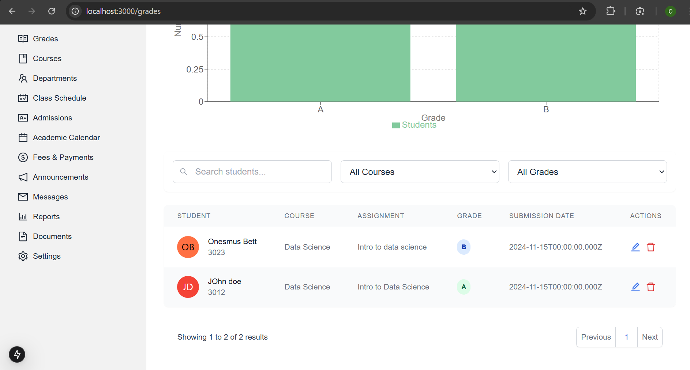

# EduAdmin Pro - School Management System


A comprehensive school management system built with Next.js, Tailwind CSS, and modern web technologies to streamline educational institution operations.

## 🛠️ Installation & Setup

1. **Clone the repository**
   ```bash
   git clone https://github.com/onesmuskipchumba0/StudentsAdminDashboard.git
   cd StudentsAdminDashboard
   ```
2. Add new features to the project
```bash
cd StudentsAdminDashboard
git checkout -b feature/new-feature
```
3. **Install dependencies**
   ```bash
        npm install
        cd backend
        npm install
        cd ..
        cd frontend
        npm install
        # or
        yarn install
   ```

4. **Set up environment variables**
   ```bash
    PORT=5000
    MONGO_URI=Your MongoDB URI
    FRONTEND_URL=http://localhost:3000
   ```

5. **Run the development server**
   ```bash
   npm run dev
   # or
   yarn dev
   ```

6. **Build for production**
   ```bash
   npm run build
   # or
   yarn build
   ```

# Home Page

A sleek, animated landing page built with Next.js and Tailwind CSS for a school management system. Features smooth animations, responsive design, and modern UI components.


## ✨ Features

### Animated Hero Section
- Gradient background with animated blob effects
- Smooth slide-in animations
- Call-to-action buttons with hover effects
- Responsive text scaling

### Feature Showcase
- Grid layout with hover animations
- Icon transitions
- Fade-in animations on scroll
- Interactive cards with elevation effects

### Statistics Display
- Animated counters
- Gradient text effects
- Responsive grid layout
- Fade-in animations

### Modern Design Elements
- Glassmorphism effects
- Gradient overlays
- Smooth transitions
- Responsive padding and spacing

# School Management Dashboard Component 📊

A comprehensive dashboard component built with Next.js and Tailwind CSS, featuring interactive charts, statistics cards, and activity monitoring for educational institutions.


## 📈 Features

### Statistics Overview
- Total Students Counter
- Active Courses Tracker
- Revenue Display
- Completion Rate Monitor
- Responsive grid layout
- Color-coded categories

### Interactive Charts
1. **Enrollment Trends**
   - Monthly student enrollment tracking
   - Line chart visualization
   - 7-month historical data

2. **Course Distribution**
   - Visual representation of course categories
   - Interactive pie/donut chart
   - Color-coded segments

3. **Attendance Analytics**
   - Daily/Weekly attendance patterns
   - Visual attendance tracking
   - Trend analysis

### Recent Activity Feed
- Real-time activity updates
- Chronological event listing
- Activity categorization

### Enrollment Trends


# Student Management & Academic Calendar Components 📚

A comprehensive set of components for managing students and academic events in an educational institution. Built with Next.js and TypeScript, featuring responsive tables, filters, and calendar views.


## 🎯 Features

### Student Management
- Searchable student database
- Status filtering (Active/Inactive/Suspended)
- Pagination system
- CRUD operations
- Responsive data table


### Academic Calendar
- Dual view modes (Calendar/List)
- Event filtering by type
- Event management
- Interactive calendar interface
- Chronological event listing

## 🔧 Component Structure

- Academic year planning
- Event scheduling and management
- Holiday and term date tracking
- Automated notifications for important dates


### Financial Management
- Fee structure management
- Payment tracking and receipts
- Financial reporting and analytics
- Multiple payment method support


### Communication Tools
- Announcements and notifications
- Internal messaging system
- Parent-teacher communication
- Bulk messaging capabilities

### Attendance Management
- Automated attendance tracking system
- Multiple attendance sessions per day
- Custom attendance periods
- Detailed attendance reports and analytics
- Mobile-friendly attendance marking


### Course Management
- Course catalog and curriculum planning
- Assignment and assessment tracking
- Learning material management
- Grade book and progress tracking


### Department Administration
- Department-wise organization
- Staff allocation and management
- Resource distribution tracking
- Inter-department coordination


### Grading System
- Flexible grading schemes
- Auto grade calculation
- Progress reports generation
- Grade analysis and statistics
- Parent grade viewing portal



### Messaging Center
- Real-time messaging
- File sharing capabilities
- Group conversations
- Message scheduling
- Read receipts and notifications


### Reports & Analytics
- Customizable report templates
- Performance analytics
- Attendance summaries
- Financial reports
- Export in multiple formats


### Schedule Management
- Class scheduling
- Teacher timetables
- Room allocation
- Conflict detection
- Schedule publishing


### System Settings
- User role management
- System configuration
- Security settings
- Backup and restore
- Integration settings


## 🚀 Technology Stack

- **Frontend:**
  - Next.js 13+ (React Framework)
  - Tailwind CSS (Styling)
  - DaisyUI (Component Library)
  - React Icons
  - TypeScript

- **UI/UX Features:**
  - Responsive design
  - Dark/Light mode
  - Multiple theme options
  - Animated components
  - Modern and clean interface


## 📱 Key Components

### Navigation
- Responsive sidebar navigation
- Quick access to all major modules
- Role-based menu items
- Collapsible menu sections

### Theme Customization
- 30+ built-in themes
- Custom color schemes
- Dark/Light mode toggle
- Consistent design language

### Data Visualization
- Interactive charts and graphs
- Real-time data updates
- Export capabilities
- Customizable reporting

## 🔐 Security Features

- Role-based access control
- Secure authentication
- Data encryption
- Session management
- Audit logging

## 📊 Performance Optimization

- Server-side rendering
- Image optimization
- Code splitting
- Lazy loading
- Caching strategies

## 🤝 Contributing

1. Fork the repository
2. Create your feature branch (`git checkout -b feature/AmazingFeature`)
3. Commit your changes (`git commit -m 'Add some AmazingFeature'`)
4. Push to the branch (`git push origin feature/AmazingFeature`)
5. Open a Pull Request

## 📄 License

This project is licensed under the MIT License - see the [LICENSE.md](LICENSE.md) file for details.

## 🔄 Updates and Roadmap

### Recent Updates
- Added multi-language support
- Improved dashboard performance
- Enhanced mobile responsiveness
- Added new report templates

## 🙏 Acknowledgments

- Next.js team for the amazing framework
- Tailwind CSS for the utility-first CSS framework
- DaisyUI for the component library
- All contributors who have helped shape this project

## 🤝 Support

If you need help or have any questions, you can:

- 📧 Email me at onesmuskipchumba5@gmail.com
- 💬 Star the repo if you like it.
- 📝 Open an issue on GitHub


